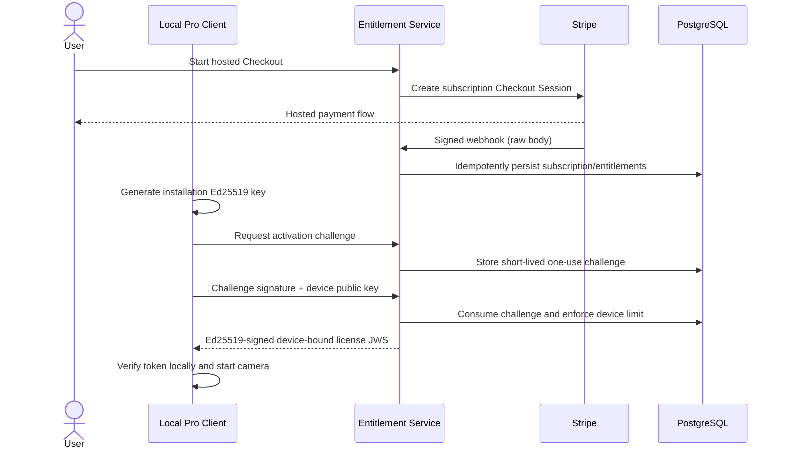

# Pro Architecture



## Data separation

The billing path contains Stripe identifiers, entitlement feature keys, and a
public installation key. The optical path contains encrypted DMOFT symbols and
camera frames. There is no API that forwards optical frames to billing.

## License token

The compact token has three unpadded base64url segments and is signed using
Ed25519 over the exact ASCII `protected.payload` signing input.

Protected header:

```json
{"alg":"EdDSA","kid":"<rotation-key-id>","typ":"DMOFT-LICENSE","v":1}
```

Required payload claims:

- `v`, `iss`, `aud`, `sub`, `jti`, `iat`, `nbf`, `exp`, `grace_until`
- `tier`, `entitlements`, `subscription_id`
- `device_id`
- `device_key_sha256`: unpadded base64url SHA-256 of the raw 32-byte
  installation Ed25519 public key

`exp - iat` is no more than 30 days and `grace_until - exp` is no more than
seven days. Clients reject unknown algorithms, token types, versions, key IDs,
issuers, audiences, malformed base64url, duplicate JSON keys, non-integer time
claims, device mismatch, missing feature, and invalid signatures.

## Activation and refresh

The device signs the exact UTF-8 challenge returned by the service. Challenge
records include purpose and request bindings, expire quickly, and are consumed
once in the same transaction that activates or refreshes a device. A deterministic
device identifier is derived as:

```text
"dmoft-device-v1-" || base64url(SHA256(raw_public_key)[0:18])
```

The private device key and license-signing private key never cross their trust
boundaries.

## Local camera path

The desktop command can open a camera directly through OpenCV. The web UI binds
only to `127.0.0.1` or `::1`; a user gesture calls `getUserMedia`, and bounded
JPEG frames are posted to that loopback service. The service feeds Community's
decoder and safe reconstruction pipeline. Stopping capture releases every media
track and camera handle.
